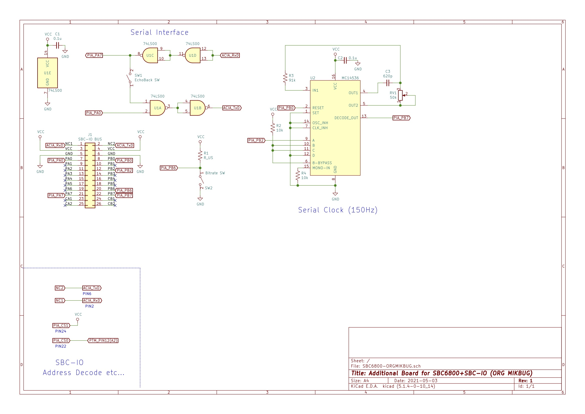

# SBC6800とSBC-IOで オリジナルMIKBUGを動かす

## 概要

* SBC6800ルーズキットとSBC-IOを使って、オリジナルのMIKBUG ROMでMC6820(MC6821)を使ったシリアル通信(300bps)ができるようになります。

## 回路図

## 参考リンク

* SBC6800ルーズキット
  * https://vintagechips.wordpress.com/2017/12/05/sbc6800%E3%83%AB%E3%83%BC%E3%82%BA%E3%82%AD%E3%83%83%E3%83%88/
* SBC-IO REV2
  *  https://sbc738827564.wordpress.com/2018/08/11/sbc-io-rev02/
